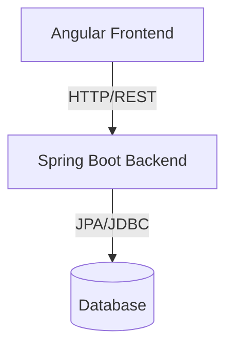

# System Architecture

## Architecture Overview
Provide a high-level overview of the ShipIntel architecture.

## Frontend (Angular)
- SPA structure
- Component layout
- State management strategy

## Backend (Spring Boot)
- MVC pattern
- Service layer / Business logic
- Data Access Objects / Repositories

## Deployment & Infrastructure
- Hosting details
- CI/CD pipelines
