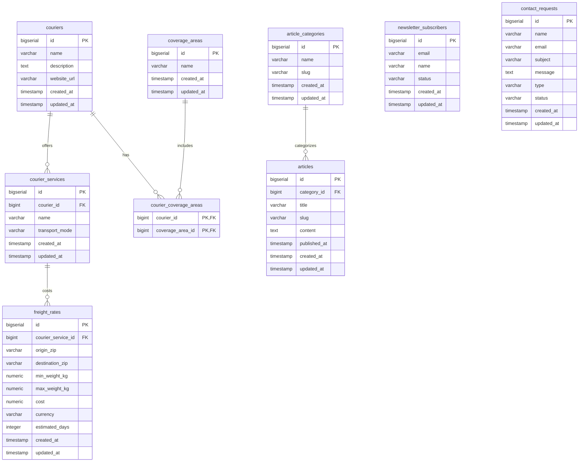

# ShipIntel Database Schema Design

## Overview
This document outlines the complete PostgreSQL database schema for the ShipIntel logistics platform. The design adheres to 3rd Normal Form (3NF), utilizes standard naming conventions, and is structured to map cleanly to JPA entities while being manageable via Flyway migrations.

---

## 1. Entity List

The database consists of the following core entities:

**Logistics & Calculator Module:**
1. `couriers` - Logistics companies (e.g., FedEx, DHL).
2. `coverage_areas` - Geographic regions served by couriers (e.g., North America, Global).
3. `courier_coverage_areas` - Mapping table for Many-to-Many relationship between Couriers and Coverage Areas.
4. `courier_services` - Specific services offered by a courier (e.g., FedEx Express) and their transport mode.
5. `freight_rates` - Rate tables used to estimate shipping costs based on origin, destination, weight, and service.

**Resources Module:**
6. `article_categories` - Categories for resources/articles.
7. `articles` - Informational content published on the platform.

**Marketing & Support Modules:**
8. `newsletter_subscribers` - Users subscribed to the mailing list.
9. `contact_requests` - Support, sales, or general inquiries.

---

## 2. Entity-Relationship Diagram (ERD)

---

## 3. Table Details

### 3.1 `couriers`
Stores information about logistics providers.

| Column | Data Type | Constraints | Description |
| :--- | :--- | :--- | :--- |
| `id` | `BIGSERIAL` | PRIMARY KEY | Unique identifier |
| `name` | `VARCHAR(100)` | NOT NULL, UNIQUE | Courier name (e.g., FedEx) |
| `description` | `TEXT` | | Description of the courier |
| `website_url` | `VARCHAR(255)`| | Official website |
| `created_at` | `TIMESTAMP` | NOT NULL, DEFAULT NOW() | Creation timestamp |
| `updated_at` | `TIMESTAMP` | NOT NULL, DEFAULT NOW() | Last update timestamp |

**Indexes:**
* `idx_couriers_name` on `name`

### 3.2 `coverage_areas`
Defines distinct regions for filtering couriers.

| Column | Data Type | Constraints | Description |
| :--- | :--- | :--- | :--- |
| `id` | `BIGSERIAL` | PRIMARY KEY | Unique identifier |
| `name` | `VARCHAR(100)` | NOT NULL, UNIQUE | Area name (e.g., Global, North America) |
| `created_at` | `TIMESTAMP` | NOT NULL, DEFAULT NOW() | Creation timestamp |
| `updated_at` | `TIMESTAMP` | NOT NULL, DEFAULT NOW() | Last update timestamp |

### 3.3 `courier_coverage_areas` (Join Table)
Many-to-Many mapping between couriers and coverage areas.

| Column | Data Type | Constraints | Description |
| :--- | :--- | :--- | :--- |
| `courier_id` | `BIGINT` | PK, FK to `couriers.id` ON DELETE CASCADE | Reference to courier |
| `coverage_area_id`| `BIGINT` | PK, FK to `coverage_areas.id` ON DELETE CASCADE| Reference to area |

**Indexes:**
* Primary key acts as a composite index.

### 3.4 `courier_services`
Specific services offered by couriers (e.g., "Air Express", "Ground").

| Column | Data Type | Constraints | Description |
| :--- | :--- | :--- | :--- |
| `id` | `BIGSERIAL` | PRIMARY KEY | Unique identifier |
| `courier_id` | `BIGINT` | NOT NULL, FK to `couriers.id` ON DELETE CASCADE| Belongs to courier |
| `name` | `VARCHAR(100)` | NOT NULL | Service name |
| `transport_mode` | `VARCHAR(50)` | NOT NULL | Enum: AIR, SEA, ROAD |
| `created_at` | `TIMESTAMP` | NOT NULL, DEFAULT NOW() | Creation timestamp |
| `updated_at` | `TIMESTAMP` | NOT NULL, DEFAULT NOW() | Last update timestamp |

**Indexes:**
* `idx_courier_services_mode` on `transport_mode`

### 3.5 `freight_rates`
Lookup table for estimating shipping costs.

| Column | Data Type | Constraints | Description |
| :--- | :--- | :--- | :--- |
| `id` | `BIGSERIAL` | PRIMARY KEY | Unique identifier |
| `courier_service_id`| `BIGINT` | NOT NULL, FK to `courier_services.id` ON DELETE CASCADE| Specific service used |
| `origin_zip` | `VARCHAR(20)` | NOT NULL | Starting postal code/zone |
| `destination_zip` | `VARCHAR(20)` | NOT NULL | Destination postal code/zone |
| `min_weight_kg` | `NUMERIC(10,2)`| NOT NULL | Minimum weight boundary |
| `max_weight_kg` | `NUMERIC(10,2)`| NOT NULL | Maximum weight boundary |
| `cost` | `NUMERIC(12,2)`| NOT NULL | Estimated cost |
| `currency` | `VARCHAR(3)` | NOT NULL, DEFAULT 'USD' | Currency code |
| `estimated_days` | `INTEGER` | | Estimated transit time |
| `created_at` | `TIMESTAMP` | NOT NULL, DEFAULT NOW() | Creation timestamp |
| `updated_at` | `TIMESTAMP` | NOT NULL, DEFAULT NOW() | Last update timestamp |

**Indexes:**
* `idx_freight_rates_lookup` on `(origin_zip, destination_zip)`

### 3.6 `article_categories`
Categories for the Resources section.

| Column | Data Type | Constraints | Description |
| :--- | :--- | :--- | :--- |
| `id` | `BIGSERIAL` | PRIMARY KEY | Unique identifier |
| `name` | `VARCHAR(100)` | NOT NULL, UNIQUE | Category name |
| `slug` | `VARCHAR(100)` | NOT NULL, UNIQUE | URL-friendly slug |
| `created_at` | `TIMESTAMP` | NOT NULL, DEFAULT NOW() | Creation timestamp |
| `updated_at` | `TIMESTAMP` | NOT NULL, DEFAULT NOW() | Last update timestamp |

### 3.7 `articles`
Resource articles and documentation.

| Column | Data Type | Constraints | Description |
| :--- | :--- | :--- | :--- |
| `id` | `BIGSERIAL` | PRIMARY KEY | Unique identifier |
| `category_id` | `BIGINT` | FK to `article_categories.id` ON DELETE SET NULL| Category reference |
| `title` | `VARCHAR(255)` | NOT NULL | Article title |
| `slug` | `VARCHAR(255)` | NOT NULL, UNIQUE | URL-friendly slug |
| `content` | `TEXT` | NOT NULL | Markdown/HTML content |
| `published_at` | `TIMESTAMP` | | When it became public |
| `created_at` | `TIMESTAMP` | NOT NULL, DEFAULT NOW() | Creation timestamp |
| `updated_at` | `TIMESTAMP` | NOT NULL, DEFAULT NOW() | Last update timestamp |

**Indexes:**
* `idx_articles_slug` on `slug`
* `idx_articles_published` on `published_at`

### 3.8 `newsletter_subscribers`
Email subscriptions.

| Column | Data Type | Constraints | Description |
| :--- | :--- | :--- | :--- |
| `id` | `BIGSERIAL` | PRIMARY KEY | Unique identifier |
| `email` | `VARCHAR(255)` | NOT NULL, UNIQUE | Subscriber email address |
| `name` | `VARCHAR(100)` | | Subscriber name |
| `status` | `VARCHAR(20)` | NOT NULL, DEFAULT 'SUBSCRIBED' | Enum: SUBSCRIBED, UNSUBSCRIBED |
| `created_at` | `TIMESTAMP` | NOT NULL, DEFAULT NOW() | Creation timestamp |
| `updated_at` | `TIMESTAMP` | NOT NULL, DEFAULT NOW() | Last update timestamp |

**Indexes:**
* `idx_newsletter_email` on `email`

### 3.9 `contact_requests`
Form submissions from the contact page.

| Column | Data Type | Constraints | Description |
| :--- | :--- | :--- | :--- |
| `id` | `BIGSERIAL` | PRIMARY KEY | Unique identifier |
| `name` | `VARCHAR(100)` | NOT NULL | Submitter's name |
| `email` | `VARCHAR(255)` | NOT NULL | Submitter's email |
| `subject` | `VARCHAR(255)` | NOT NULL | Request subject |
| `message` | `TEXT` | NOT NULL | Detailed message |
| `type` | `VARCHAR(50)` | NOT NULL | Enum: SUPPORT, SALES, GENERAL |
| `status` | `VARCHAR(50)` | NOT NULL, DEFAULT 'PENDING' | Enum: PENDING, IN_PROGRESS, RESOLVED |
| `created_at` | `TIMESTAMP` | NOT NULL, DEFAULT NOW() | Creation timestamp |
| `updated_at` | `TIMESTAMP` | NOT NULL, DEFAULT NOW() | Last update timestamp |

**Indexes:**
* `idx_contact_requests_status` on `status`

---

## 4. Future Scalability Considerations

1. **Partitioning:** If the `freight_rates` table grows immensely due to high-granularity zone-to-zone mappings across multiple couriers, consider **Table Partitioning** by `courier_service_id` or `origin_zip` ranges to improve query performance.
2. **Audit Logging:** Instead of just `created_at` and `updated_at`, implement a dedicated `audit_logs` table (or use tools like Envers in JPA) for entities like `freight_rates` or `couriers` to track exactly *who* changed a rate and *when*.
3. **Full-Text Search:** For `articles` and `couriers`, scaling search beyond basic `ILIKE` clauses will require implementing PostgreSQL's built-in `tsvector` and `tsquery` for full-text search, or offloading search to Elasticsearch if the volume becomes massive.
4. **Soft Deletes:** Consider adding a `deleted_at` timestamp or `is_active` boolean on tables like `couriers` and `courier_services` to preserve historical integrity in `freight_rates` and order history instead of hard-deleting records.
